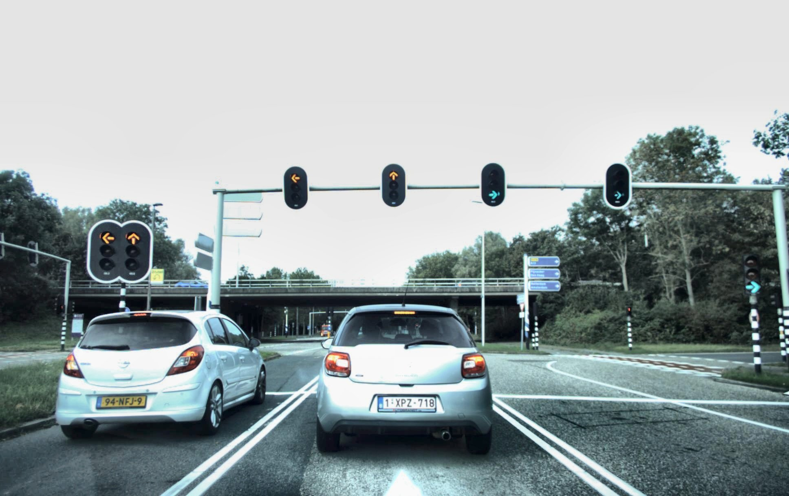
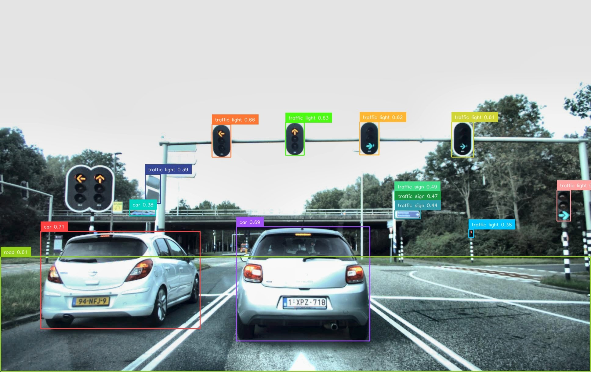
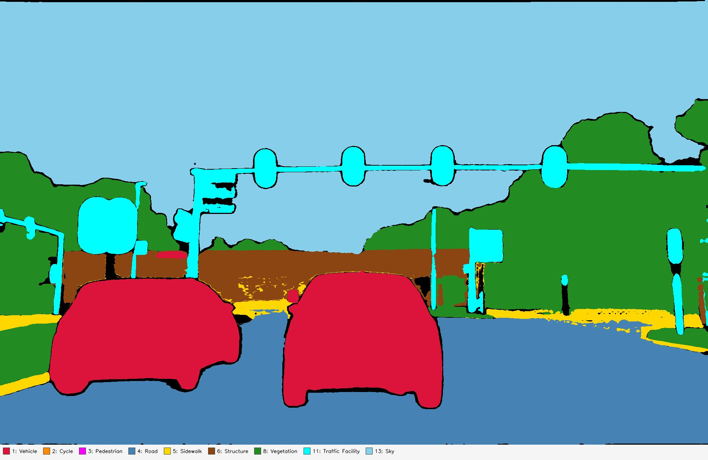
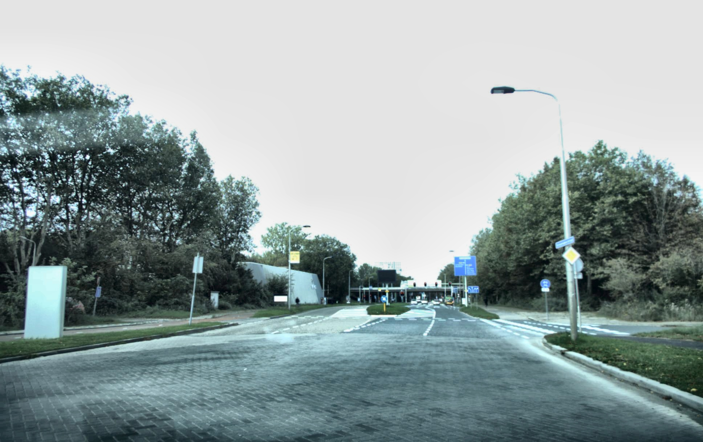
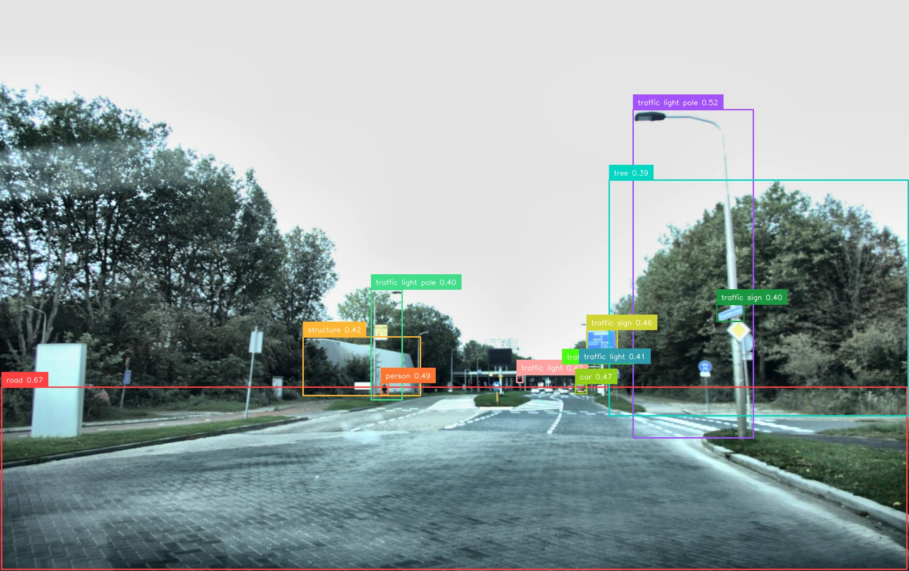
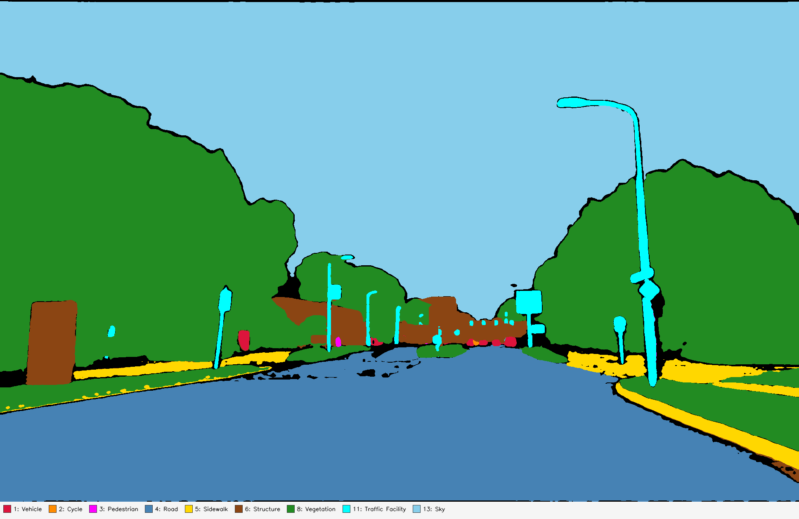

# Grounded SAM 2 → 9-Class Semantic Segmentation (SemanticKITTI)


A closed-set semantic segmentation pipeline built on **[Grounded SAM 2](https://github.com/IDEA-Research/Grounded-SAM-2)** ([SAM 2](https://arxiv.org/abs/2408.00714) + [Grounding DINO](https://arxiv.org/abs/2303.05499)). Designed as an OpenSeeD-style upstream component for autonomous-driving datasets — deterministic class IDs, fixed color palette, dense per-pixel labels, robust to prompt overlap and single-frame flicker.

[[`SAM 2`](https://arxiv.org/abs/2408.00714)] [[`Grounding DINO`](https://arxiv.org/abs/2303.05499)] [[`OpenSeeD`](https://arxiv.org/abs/2303.08131)] [[`BibTeX`](#citation)]

---

## What's Different in This Fork

Upstream Grounded SAM 2 takes a free-form text prompt and grounds whatever the user types — flexible but unsuitable as a stable upstream component. This fork rewires the pipeline into a **fixed 9-class semantic segmentation system**:

- **9 deterministic categories** with stable IDs (Vehicle=1, …, Sky=13) and a fixed color palette
- **Per-class prompt lists** (synonyms / hyponyms) and **per-class box / text thresholds**
- **Dense outputs** — every pixel gets a class ID; the mask is a single-channel PNG indexed by ID
- **Robust against prompt overlap and frame-to-frame flicker** via cross-class NMS + targeted post-processing
- **Engineering for throughput**: cached GDino backbone, batched SAM 2, FP16 autocast, optional `torch.compile`, CPU image prefetching, resumable runs

## Pipeline Overview

The core script is `grounded_sam2_semantic_kitti_semseg.py`. Each image goes through 4 phases:

```
[1] Grounding DINO ×9 (one call per class)
        │  ─ image backbone features cached on first call,
        │    reused for the next 8 calls (~7× speedup over naive)
        │  ─ per-class box/text thresholds
        │  ─ per-class box-area filter (Veg/Sky/Road bypass; Traffic Facility ≤8%)
        ▼
[2] SAM 2 batched mask prediction
        │  ─ all kept boxes from all classes, single predict() call
        │  ─ chunked by --sam2_batch_limit (default 256) for VRAM safety
        ▼
[3] Cross-class NMS on mutex pairs
        │  ─ (Road, Sidewalk), (Vehicle, Cycle)
        │  ─ mask-level IoU > 0.40 → drop the lower-confidence mask
        │    (kills the dominant cause of frame-to-frame flicker)
        ▼
[4] Per-pixel confidence merge + post-processing
        │  ─ within-class: highest-confidence mask wins each pixel
        │  ─ Vegetation: morphological close (kernel 7) — fill leaf gaps
        │  ─ Sky / Road / Vegetation: keep largest blob, drop blobs <1500 px
        │  ─ Sidewalk/Road sanity: if |Sidewalk| > 3·|Road|, demote the
        │    largest sidewalk blob back to Road
        ▼
   semantic_mask  (uint8, H×W, pixel = class ID)
```

## Categories

The 9-class taxonomy is defined in `SEMANTIC_PROMPTSET` and `SEMANTIC_CLASS_ID_MAP` at the top of the main script.

| ID | Category         | RGB             | Prompt aliases (sent to GDino)                                                                                                                                  |
|:--:|:-----------------|:----------------|:----------------------------------------------------------------------------------------------------------------------------------------------------------------|
| 1  | Vehicle          | (220, 20, 60)   | car, SUV, van, bus, truck, trailer, engineering vehicle, construction vehicle, dump truck, excavator, crane, concrete mixer                                     |
| 2  | Cycle            | (255, 140, 0)   | bicycle, motorcycle, motor scooter, e-bike                                                                                                                      |
| 3  | Pedestrian       | (255, 0, 255)   | person, pedestrian, adult, child, rider                                                                                                                         |
| 4  | Road             | (70, 130, 180)  | road, drivable surface, lane, lane marking                                                                                                                      |
| 5  | Sidewalk         | (255, 215, 0)   | sidewalk, curb, bike path, walkway, pavement, footpath, footway                                                                                                 |
| 6  | Structure        | (139, 69, 19)   | building, building facade, building exterior, house, garage, wall, concrete wall, retaining wall, stairs, railing, awning, roof, bridge                         |
| 8  | Vegetation       | (34, 139, 34)   | tree, bush, shrub, plant, flower, grass                                                                                                                         |
| 11 | Traffic Facility | (0, 255, 255)   | pole, traffic light pole, street light pole, sign pole, traffic sign, road sign, speed limit sign, traffic light, traffic signal                                |
| 13 | Sky              | (135, 206, 235) | sky, cloudy sky, overcast sky                                                                                                                                   |

> ID `0` is reserved for **ignore / no-prediction** pixels. The non-contiguous IDs (skipping 7, 9, 10, 12) leave room for future classes without breaking downstream consumers.

### Per-class thresholds & area filters

| Category         | box_thr | text_thr | Box area filter         |
|:-----------------|:-------:|:--------:|:------------------------|
| Vehicle          | 0.16    | 0.16     | ≤ 40 % of image area    |
| Cycle            | 0.22    | 0.22     | ≤ 40 % of image area    |
| Pedestrian       | 0.16    | 0.16     | ≤ 40 % of image area    |
| Road             | 0.10    | 0.10     | **bypassed** (can fill the frame) |
| Sidewalk         | 0.13    | 0.13     | ≤ 40 % of image area    |
| Structure        | 0.10    | 0.10     | ≤ 40 % of image area    |
| Vegetation       | 0.10    | 0.10     | **bypassed**            |
| Traffic Facility | 0.16    | 0.16     | **≤ 8 %** (poles/lights are never huge) |
| Sky              | 0.08    | 0.08     | **bypassed**            |

## Results

Each scene shows **Original → Detection (Phase 1, before NMS) → Final 9-class color map (Phase 4)**.

### Example 1 — open road approaching a signalized junction

| Original | Phase 1: GDino detections | Phase 4: 9-class color map |
|:---:|:---:|:---:|
|  |  |  |

### Example 2 — stopped behind two cars at a traffic light

| Original | Phase 1: GDino detections | Phase 4: 9-class color map |
|:---:|:---:|:---:|
|  |  |  |

Notes:
- Detection confidences in the bbox figures sit around 0.35–0.7 — that's intentional. Per-class thresholds are tuned low (some as low as 0.08 for Sky / 0.10 for Road) because cross-class NMS + the merge stage absorb the false positives.
- Pixels left **black** in the color map are class `0` (ignore) — useful as a downstream confidence signal: black = "no class fired here, treat as unknown".

## Installation

Same as upstream Grounded SAM 2.

```bash
# SAM 2 checkpoints
cd checkpoints && bash download_ckpts.sh && cd ..

# Grounding DINO checkpoints
cd gdino_checkpoints && bash download_ckpts.sh && cd ..
```

Environment: `python=3.10`, `torch>=2.3.1`, `torchvision>=0.18.1`, `cuda-12.1`. Make sure `CUDA_HOME` is set so Grounding DINO can compile its Deformable Attention op:

```bash
export CUDA_HOME=/path/to/cuda-12.1/

pip3 install torch torchvision torchaudio
pip install -e .                                    # SAM 2
pip install --no-build-isolation -e grounding_dino  # Grounding DINO
pip install albumentations tqdm                     # for helpers.py
```

Or via Docker:

```bash
cd Grounded-SAM-2 && make build-image && make run
```

## Usage

### Minimal SemanticKITTI run

```bash
python grounded_sam2_semantic_kitti_semseg.py \
    --input_dir  /path/to/SemanticKITTI/dataset/sequences \
    --output_dir outputs/grounded_sam2_semantic_kitti_semseg
```

This walks every sequence in `--views` (default `00`–`10`), reads `image_2/*.png` per sequence, and writes the semantic mask to `outputs/.../<view>/<frame_stem>.png` as a single-channel PNG where pixel value = class ID.

### Common flags

```bash
# Process only sequences 04 and 05
--views 04 05

# Process only specific frame numbers (e.g. for debugging)
--frame_ids 0 100 200

# Save colored previews + overlay for the first 20 frames (sanity-check runs)
--save_color_preview_n 20

# Save debug overlays (with the matching prompt text drawn on each region)
--save_debug_preview_n 20

# Disable FP16 (default is on)
--no-use_fp16

# Apply torch.compile to GDino + SAM2 (warmup cost, ~20-30% speedup after)
--compile

# Robustness eval: apply an albumentations augmentation before inference
--aug_type clahe              # one of the helpers.py types
--aug_type strong-1           # 7-op composite
--aug_type horizontal-flip    # mask is flipped back at the end

# Tune cross-class NMS aggressiveness (default 0.40, lower = more aggressive)
--cross_nms_iou 0.30

# Throughput tuning
--sam2_batch_limit 128        # lower if SAM2 OOMs
--prefetch_workers 4          # CPU image prefetch threads

# Resumable runs (default behavior — skips frames whose mask already exists)
# Add --overwrite to force regeneration
--overwrite
```

### Output layout

```
outputs/grounded_sam2_semantic_kitti_semseg/
├── 00/
│   ├── 000000.png          # grayscale, pixel = class ID (always written)
│   ├── 000000_color.png    # colored mask + legend strip      (--save_color_preview_n)
│   ├── 000000_overlay.png  # 0.45-alpha overlay + legend      (--save_color_preview_n)
│   ├── 000000_debug.png    # overlay with prompt text labels  (--save_debug_preview_n)
│   └── ...
├── 01/
└── ...
```

## What's in `helpers.py`

`helpers.py` is a utility module containing alternative taxonomies and the augmentation suite.

### Prompt taxonomies

Four reference prompt sets are defined for cross-dataset experiments:

| Variable                       | Classes | Use case                                          |
|:-------------------------------|:-------:|:--------------------------------------------------|
| `promptset_base`               | 17      | nuScenes-lidarseg full taxonomy (thing + stuff)   |
| `promptset_thing_base`         | 10      | nuScenes things only (movable objects)            |
| `promptset_stuff_base`         | 7       | nuScenes stuff only (background classes)          |
| `promptset_semantic_kitti_base`| 20      | SemanticKITTI 19-class + sky                      |

The 9-class taxonomy used by the main script is defined inline in the script (`SEMANTIC_PROMPTSET`); the helper taxonomies are kept available so you can fork the script for a different target dataset without rewriting the prompt-collection logic.

### Augmentation suite

`get_augmentation(aug_type)` returns an `albumentations` transform. Used by the `--aug_type` CLI flag for robustness experiments. Available types:

- **Color**: `color-jitter`, `hue-saturation`, `random-brightness-contrast`, `rgb-shift`, `random-gamma`, `random-tone-curve`, `clahe`, `auto-contrast`, `to-gray`, `solarize`, `fancy-pca`
- **Blur / sharpen**: `blur`, `defocus`, `glass-blur`, `sharpen`, `emboss`
- **Noise**: `gauss-noise`, `iso-noise`, `salt-and-pepper`, `shot-noise`
- **Geometric**: `horizontal-flip`, `vertical-flip` (mask is flipped back automatically)
- **Weather**: `random-fog`, `random-rain`, `random-snow`, `random-shadow`, `random-sun-flare`
- **Optical**: `chromatic-aberration`, `superpixels`
- **Composite**: `strong-1` — chains ColorJitter + HueSaturationValue + Blur + ChromaticAberration + Emboss + FancyPCA + CLAHE

### nuScenes split helper

`get_nuscenes_set(split="val")` builds and pickles a per-camera filename list from the official nuScenes splits (requires the `nuscenes-devkit` package and a local `/datasets/nuscenes` mount). The import is lazy, so the rest of the module works without nuScenes installed.

## Underlying Open-Vocabulary Demos (Inherited)

The original free-text-prompt demos still work — handy when you want to sanity-check Grounding DINO on a new class before adding it to the taxonomy.

- `python grounded_sam2_local_demo.py` — Grounding DINO + SAM 2, local checkpoint
- `python grounded_sam2_hf_model_demo.py` — Grounding DINO via HuggingFace
- `python grounded_sam2_dinox_demo.py` — DINO-X via DDS API (token required)
- `python grounded_sam2_tracking_demo.py` — video tracking with SAM 2 memory

> 🚨 HuggingFace network issues: `export HF_ENDPOINT=https://hf-mirror.com` (the main script sets this by default).

See the [original Grounded SAM 2 README](https://github.com/IDEA-Research/Grounded-SAM-2) for the full set of free-prompt demos (Florence-2 auto-labeling, SAHI tiled inference, continuous-ID video tracking).

## Latest Updates

- **9-class semantic-segmentation pipeline (v4)** — `grounded_sam2_semantic_kitti_semseg.py`, with cached GDino backbone, batched SAM 2, cross-class NMS for mutex pairs, and a 3-stage post-processing chain. Replaces free-text prompts as the recommended entry point for downstream perception tasks.
- **Robustness eval suite** — 28 `albumentations` augmentations + a `strong-1` composite via `helpers.py`. Flip augmentations correctly invert the predicted mask.
- **Prompt taxonomies for cross-dataset use** — nuScenes 17-class (full / thing / stuff) and SemanticKITTI 20-class prompt dictionaries shipped in `helpers.py`.
- Inherits everything upstream: SAM 2.1 checkpoints, DINO-X integration, SAHI, video tracking with continuous IDs.

## Citation

```bibtex
@misc{ravi2024sam2segmentimages,
      title={SAM 2: Segment Anything in Images and Videos},
      author={Nikhila Ravi and Valentin Gabeur and Yuan-Ting Hu and Ronghang Hu and Chaitanya Ryali and Tengyu Ma and Haitham Khedr and Roman Rädle and Chloe Rolland and Laura Gustafson and Eric Mintun and Junting Pan and Kalyan Vasudev Alwala and Nicolas Carion and Chao-Yuan Wu and Ross Girshick and Piotr Dollár and Christoph Feichtenhofer},
      year={2024}, eprint={2408.00714}, archivePrefix={arXiv}, primaryClass={cs.CV},
      url={https://arxiv.org/abs/2408.00714}
}

@article{liu2023grounding,
  title={Grounding DINO: Marrying DINO with Grounded Pre-Training for Open-Set Object Detection},
  author={Liu, Shilong and Zeng, Zhaoyang and Ren, Tianhe and Li, Feng and Zhang, Hao and Yang, Jie and Li, Chunyuan and Yang, Jianwei and Su, Hang and Zhu, Jun and others},
  journal={arXiv preprint arXiv:2303.05499}, year={2023}
}

@misc{ren2024grounded,
      title={Grounded SAM: Assembling Open-World Models for Diverse Visual Tasks},
      author={Tianhe Ren and Shilong Liu and Ailing Zeng and Jing Lin and Kunchang Li and He Cao and Jiayu Chen and Xinyu Huang and Yukang Chen and Feng Yan and Zhaoyang Zeng and Hao Zhang and Feng Li and Jie Yang and Hongyang Li and Qing Jiang and Lei Zhang},
      year={2024}, eprint={2401.14159}, archivePrefix={arXiv}, primaryClass={cs.CV}
}

@inproceedings{zhang2023simple,
  title={A Simple Framework for Open-Vocabulary Segmentation and Detection},
  author={Zhang, Hao and Li, Feng and Zou, Xueyan and Liu, Shilong and Li, Chunyuan and Yang, Jianwei and Zhang, Lei},
  booktitle={ICCV}, year={2023}
}

@article{behley2019iccv,
  author = {J. Behley and M. Garbade and A. Milioto and J. Quenzel and S. Behnke and C. Stachniss and J. Gall},
  title = {{SemanticKITTI: A Dataset for Semantic Scene Understanding of LiDAR Sequences}},
  booktitle = {ICCV}, year = {2019}
}

@article{kirillov2023segany,
  title={Segment Anything},
  author={Kirillov, Alexander and Mintun, Eric and Ravi, Nikhila and Mao, Hanzi and Rolland, Chloe and Gustafson, Laura and Xiao, Tete and Whitehead, Spencer and Berg, Alexander C. and Lo, Wan-Yen and Doll{\'a}r, Piotr and Girshick, Ross},
  journal={arXiv:2304.02643}, year={2023}
}
```